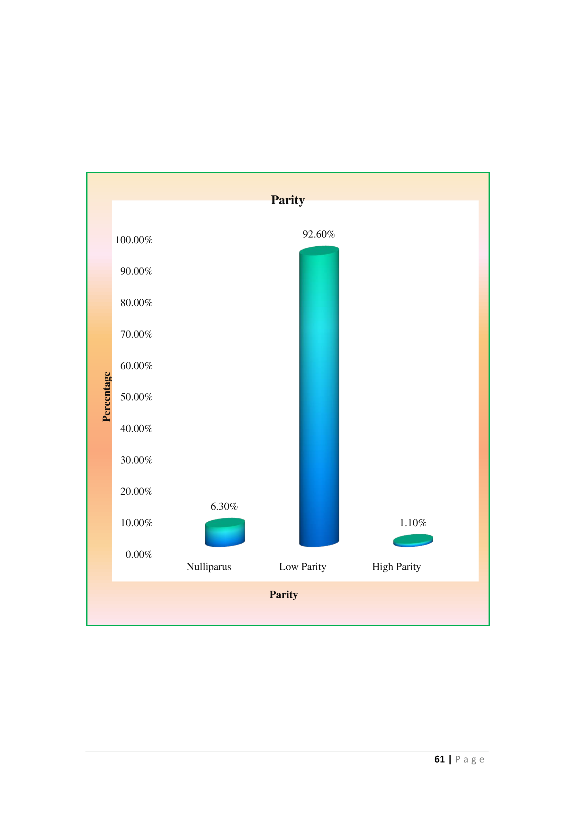
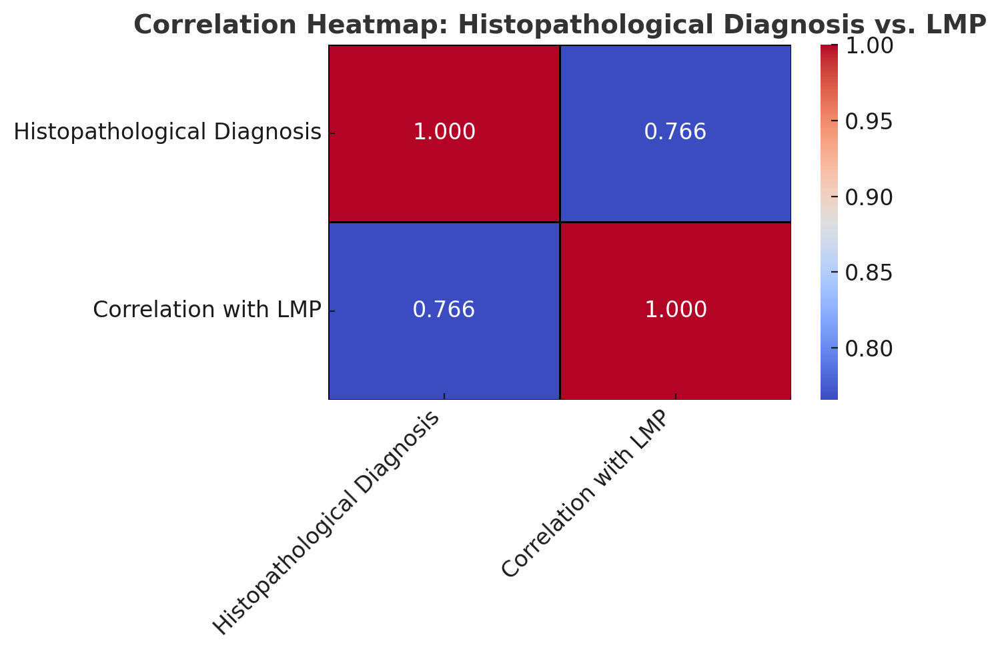
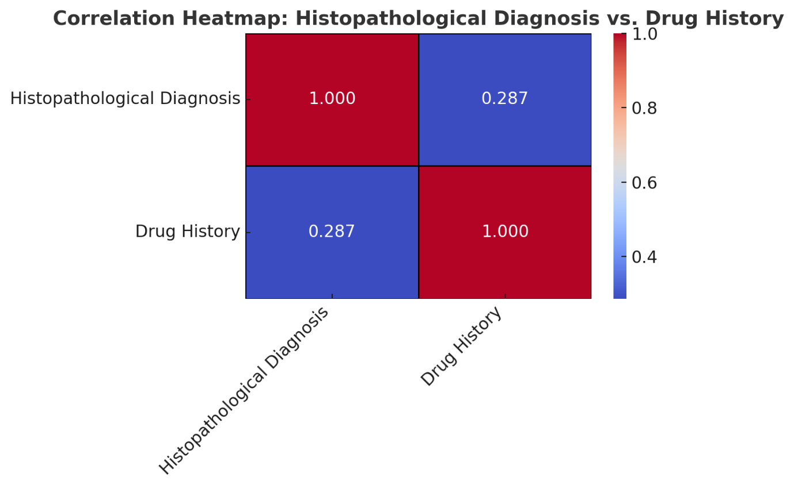
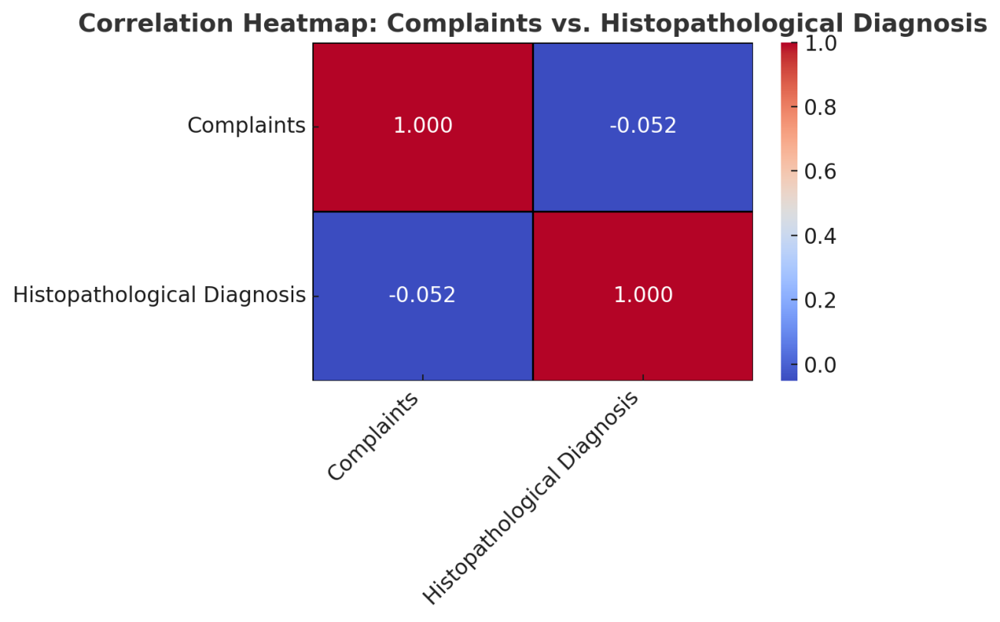

# Histopathological Patterns in Abnormal Uterine Bleeding - Thesis

## INTRODUCTION

Abnormal uterine bleeding (AUB) is an umbrella term encompassing various forms of uterine bleeding that deviate from the normal menstrual pattern in terms of regularity, volume, duration, or frequency. It is defined as bleeding originating from the uterine corpus in a non-pregnant woman. AUB can manifest as heavy menstrual bleeding, irregular menstrual bleeding, or postmenopausal bleeding, which all differ in severity and cause. This condition has emerged as a leading cause for gynecologic consultation, significantly affecting a substantial portion of the female population. The impact of AUB is widespread, with studies suggesting that up to 14-25% of women in the reproductive age group, and up to 50% of women in the perimenopausal phase, experience some form of abnormal uterine bleeding^1,2,3^.

Abnormal uterine bleeding is considered a common complaint, often causing considerable physical and emotional distress to affected individuals. In reproductive-aged women, it frequently leads to impaired quality of life, with symptoms such as heavy menstrual bleeding (HMB) causing anemia, fatigue, and restriction in daily activities. Furthermore, AUB often leads women to seek medical advice as the condition may be associated with underlying pathologies, including uterine fibroids, polyps, endometrial hyperplasia, and, in more serious cases, malignancy^4^. As women approach perimenopause, the frequency and severity of AUB tend to increase, mainly due to hormonal changes, aging, and the onset of structural uterine abnormalities^5^.

### The Significance of AUB and its Prevalence

Abnormal uterine bleeding is a condition that varies widely in terms of its prevalence, depending on age, geography, and health conditions. Studies suggest that the prevalence of AUB in reproductive-age women ranges from 3% to 30%, with some reports noting that it can affect up to one-third of women at some point in their lives^6^. The condition also disproportionately affects perimenopausal and postmenopausal women, as they are at increased risk of underlying structural uterine changes such as fibroids and endometrial hyperplasia. In postmenopausal women, AUB is particularly concerning because it raises the possibility of malignancy, necessitating a thorough evaluation^6^.

Perimenopause is a phase of transition before menopause, generally beginning between 45 and 47 years of age, marked by irregular cycles and hormonal fluctuations, which can contribute to AUB^4^. The World Health Organization (WHO) defines perimenopause as the period extending from two to eight years before menopause, characterized by a decline in ovarian function and a reduction in estrogen production. This phase is often marked by unpredictable menstrual cycles, with some women experiencing an increase in menstrual flow, while others experience irregular bleeding or skipped periods^4,5^.

In terms of structural abnormalities, common causes of AUB during the reproductive years include uterine fibroids (leiomyomas), endometrial polyps, and adenomyosis. As women approach perimenopause, however, conditions like endometrial hyperplasia and carcinoma become more prevalent. This shift in pathology underscores the importance of tailoring diagnostic and therapeutic strategies based on a woman's age and reproductive status^7^.

### Nomenclature and Classification of AUB

Historically, AUB was described using a variety of inconsistent terms such as menorrhagia, metrorrhagia, and dysfunctional uterine bleeding (DUB). These terms often overlapped and failed to provide clear diagnostic distinctions. In response to this, the International Federation of Gynecology and Obstetrics (FIGO) introduced a consensus on the terminology for AUB in 2007. This consensus aimed to standardize terminology and provide a more comprehensive and clinically relevant classification system. In 2011, FIGO published an updated classification that included the PALM-COEIN system, which classifies AUB into structural and non-structural categories based on the underlying pathology. The PALM-COEIN system includes the following categories:

- **P** – Polyp (AUB-P)
- **A** – Adenomyosis (AUB-A)
- **L** – Leiomyoma (AUB-L)
- **M** – Malignancy and Hyperplasia (AUB-M)
- **C** – Coagulopathy (AUB-C)
- **O** – Ovulatory Dysfunction (AUB-O)
- **E** – Endometrial (AUB-E)
- **N** – Iatrogenic and Not Otherwise Classified (AUB-N)^7,8^

This classification system has revolutionized the understanding of AUB by categorizing its causes into structural (e.g., polyps, fibroids, endometrial carcinoma) and non-structural factors (e.g., coagulopathies, ovulatory dysfunction). The PALM-COEIN system is instrumental in guiding clinical management, ensuring that both clinicians and patients can communicate effectively about the underlying causes of AUB. It also facilitates research by providing a unified framework for investigating the etiology of abnormal uterine bleeding^7^.

### Pathophysiology and Mechanisms of AUB

The pathophysiology of AUB is multifactorial and varies depending on the underlying cause. In cases involving structural abnormalities such as uterine fibroids, polyps, or adenomyosis, the uterus becomes unable to function normally during the menstrual cycle. Fibroids, for instance, can disrupt the endometrial lining, leading to heavy bleeding and irregular cycles. Similarly, polyps or endometrial hyperplasia can result in abnormal bleeding patterns due to abnormal growth of endometrial tissue^7^.

In addition to structural causes, non-structural factors, such as ovulatory dysfunction, also play a crucial role in AUB. Ovulatory dysfunction, commonly associated with anovulatory cycles, can result in irregular shedding of the endometrium, leading to heavy bleeding. This is often seen in adolescent girls and women in the perimenopausal period due to hormonal fluctuations or insufficient progesterone production during the luteal phase of the menstrual cycle^6,8^.

Moreover, coagulopathies (disorders of blood clotting) can significantly contribute to abnormal uterine bleeding. Women with underlying bleeding disorders, such as von Willebrand disease or platelet dysfunction, are at increased risk for heavy or prolonged bleeding episodes. The pathophysiology of coagulopathies in AUB involves a disruption in the normal coagulation cascade, preventing proper clot formation and leading to excessive menstrual flow^8^.

One of the critical contributors to primary endometrial dysfunction is a disturbance in the mechanisms responsible for endometrial hemostasis. This can result from a failure to produce adequate vasoconstrictors such as endothelin-1 and prostaglandin F2α, or from excessive production of vasodilators like prostaglandin E2 and prostacyclin, which promote vasodilation and increase blood flow to the uterus. These imbalances can lead to abnormal bleeding, particularly during menstruation, when the endometrial tissue is naturally undergoing shedding^9-11^.

Chronic endometrial inflammation or infection may also play a role in AUB. Although chronic endometritis has been recognized as a potential cause of AUB, its exact relationship with abnormal bleeding remains unclear. Chronic endometritis may occur due to infections or long-term inflammation within the uterus, leading to changes in the endometrial lining that could contribute to abnormal bleeding patterns. However, there is insufficient evidence to classify it definitively as a major cause of AUB, and it is often regarded as a diagnosis of exclusion^12,13^.

### Diagnostic Approaches to AUB

The diagnosis of AUB requires a systematic approach, starting with a detailed patient history and physical examination. A thorough history helps to identify potential causes, such as medications (e.g., anticoagulants, hormonal therapies), underlying health conditions (e.g., thyroid dysfunction, coagulopathies), or a history of uterine pathology (e.g., fibroids or polyps). Exclusion of pregnancy-related causes is paramount, especially in reproductive-aged women, as pregnancy complications (e.g., miscarriage, ectopic pregnancy) can lead to abnormal bleeding^14^.

The next step in the diagnostic workup is endometrial sampling (biopsy), which is considered the gold standard for diagnosing AUB. Endometrial biopsy involves the collection of tissue from the uterine lining for histopathological evaluation. This procedure is critical in diagnosing conditions such as endometrial hyperplasia, carcinoma, and inflammatory disorders. Additionally, hysteroscopy has gained popularity as a diagnostic tool, as it provides direct visualization of the uterine cavity, allowing for the detection of focal lesions such as polyps, fibroids, and other structural abnormalities^14,3^.

Dilation and curettage (D&C) remains a common procedure for obtaining endometrial tissue, especially in settings where hysteroscopy is not readily available. However, D&C has limitations, particularly in its inability to detect focal lesions or malignancy in some cases, especially in postmenopausal women. Therefore, combining D&C with complementary imaging techniques, such as saline infusion sonohysterography or hysteroscopy, can enhance diagnostic accuracy and improve management^3,4^.

Ultrasound imaging is also commonly used in the evaluation of AUB, especially to assess for structural lesions such as fibroids and polyps. While it is a non-invasive and widely accessible tool, ultrasound may not always provide sufficient detail for accurate diagnosis, particularly when there are focal lesions in the uterine cavity. In such cases, advanced imaging or direct visualization via hysteroscopy may be necessary^14,8^.

## REVIEW OF LITERATURE

**Liu Z et al., (2007)^15^** conducted a systematic review of the medical literature to evaluate the impact of abnormal uterine bleeding (AUB) on health related quality of life (HRQoL) and to quantify the economic burden of AUB from a societal perspective. The search yielded 1009 English-language articles. Ninety-eight studies (including randomized controlled trials, observational studies, and reviews) that met the inclusion and exclusion criteria underwent a full-text review. The prevalence of AUB among women of reproductive age ranged from 10% to 30%. The HRQoL scores from the 36-item Short-Form Health Survey Questionnaire (SF-36) suggested that women with AUB have HRQoL below the 25th percentile of that for the general female population within a similar age range. The conservatively estimated annual direct and indirect economic costs of AUB were approximately $1 billion and $12 billion, respectively. The burden of AUB needs further and more thorough investigation. Additional research should prospectively evaluate the impact of AUB and the value of treatment provided to help guide future health resource allocation and clinical decision-making.

**Bhosle A and Fonseca M (2010)^16^** did a study to evaluate clinically the gynaecological causes of abnormal uterine bleeding in perimenopausal women and to correlate clinical evaluation with ultrasonographic and histopathological examination. Retrospective study of 112 perimenopausal women with abnormal uterine bleeding for a period of 6 months. These women were evaluated and clinical, ultrasonographic and histopathological findings were correlated. The major symptom with which the women presented was menorrhagia in 53.3%. All these women underwent D and C followed by medical management or hysterectomy depending upon the diagnosis. The HPE of endometrium was analysed. The HPE of uterus confirmed fibroid uterus and DUB correlated well with ultrasonographic and histopathological examination. Clinical as well as USG proved less useful for diagnosing adenomyosis.

**Doraiswami S et al., (2011)^17^** conducted a study to analyze the histopathology of the endometrium and identify the causes of abnormal uterine bleeding (AUB) across different age groups. The study was carried out at Sri Ramachandra Medical College and Research Institute, Chennai, India, involving 620 patients who presented with AUB between June 2005 and June 2006. Out of these, 409 cases with isolated endometrial lesions diagnosed by histopathology were included in the final analysis. Statistical analysis using the chi-square test was performed to assess the relationship between age and specific endometrial causes. The most common age group with AUB was 41–50 years (33.5%), with the predominant finding being a normal cycling endometrium (28.4%). The most frequent pathology across all age groups was a disordered proliferative pattern (20.5%). Other identified causes included pregnancy-related complications (22.7%), benign endometrial polyps (11.2%), endometrial hyperplasia (6.1%), endometrial carcinoma (4.4%), and chronic endometritis (4.2%). The study found a statistically significant association between age and endometrial pathology (P < 0.05). In perimenopausal women, AUB was most commonly of dysfunctional origin, while in reproductive-aged women, pregnancy complications should be considered first. The high incidence of disordered proliferative patterns suggests early presentation of these patients.

**Khan S et al., (2011)^18^** studied the histopathological patterns of the endometrium in patients with abnormal uterine bleeding (AUB) at Madina Teaching Hospital. The study included patients who presented to the outpatient department with AUB, and after meeting specific inclusion and exclusion criteria, they underwent a detailed history taking, physical and gynecological examinations, pelvic ultrasound, and diagnostic D&C. Endometrial biopsy samples were sent for histopathological analysis in the hospital's pathology department. Data was collected over 18 months and analyzed using SPSS version 15. The most common histopathological finding was proliferative phase endometrium (46.4%), followed by secretory phase endometrium (37.6%). Other findings included cystic (5.2%), adenomatous (3.8%), and atypical (3.6%) hyperplasia, which together accounted for 12.6% of cases. Endometritis was found in 1.4% of cases, atrophic endometrium in 1%, polyps in 0.6%, and endometrial carcinoma in 0.4%. The study concluded that the histopathological patterns in patients with AUB varied widely, regardless of age, parity, or ethnicity.

**Forae GD and Aligbe JU (2013)^19^** conducted a study aimed to examine the frequency and histological patterns of endometrial lesions in women with abnormal uterine bleeding (AUB) in Benin City, Nigeria. The study reviewed archived H&E-stained slides of endometrial biopsies from the Ashamas Foundation Histopathology Diagnostic Center over a 10-year period. The researchers analyzed clinical data, diagnoses, and biopsy types, and the results were entered into Microsoft Excel and analyzed using SPSS software for descriptive statistics. A total of 231 endometrial lesions were identified, with 207 cases (89.6%) occurring in reproductive and perimenopausal women, and 24 cases (10.4%) in postmenopausal women. The age range of patients was 17 to 86 years, with the highest incidence occurring in the fourth decade, and a mean age of 38.8 years. Among the lesions, the most common finding in reproductive and premenopausal women was product of conception (27.7%, 64/231 cases), while complex endometrial hyperplasia was the most frequent lesion in postmenopausal women (2.6%, 6/231 cases). The study concluded that the histopathological patterns of endometrial lesions in women with AUB varied, with product of conception being most common in reproductive-aged women and endometrial hyperplasia more frequently observed in perimenopausal women.

[Content continues with more literature review entries...]

## AIMS AND OBJECTIVES

1. To identify the various histopathological patterns in the endometrial biopsies and curetting in the patients of AUB.

2. To see the correlation of the endometrial Biopsies and curetting in AUB with the radiological findings (if any) in these patients.

## MATERIAL AND METHODS

The present observational study (retrospective, prospective) study will be conducted in Department of Pathology, SKIMS Medical College, Bemina Srinagar, after obtaining clearance from the Institutional Ethical Committee. Retrospectively (February 2022 February 2023) data was be obtained from the MRD section or archives of the Department of Pathology while as prospective study was be done with effect from (March 2023 – March 2025).

Study will be done on dilatation and curettage material obtained from women with a complaint of AUB attending the Department of Obstetrics and Gynaecology, SKIMS Srinagar.

### Inclusion criteria

- Endometrial biopsies and curettings from the patients presenting with AUB irrespective of age group (excluding unmarried girls)

### Exclusion criteria

- Patient presented with unsatisfactory samples like only blood clots and fibrin and no endometrial glands/stroma.
- AUB due to gestational causes like tubal pregnancy, molar pregnancy and abortion.
- Patients on hormone therapy within the last 6 month.
- Cervical pathology e.g. cervical cancer.

### METHODOLOGY

Endometrial curettings are obtained by dilatation and curettage under sedation. All specimens will be sent for histology fixed in 10% neutral buffered formalin and submitted to routine tissue processing and paraffin embedding.

#### Adequacy Criteria:

Endometrial specimens are now taken at outpatients by pipelle or other techniques, with the result that many biopsy specimens contain scant, or even no, endometrial tissue. Paradoxically, superficial endometrial biopsy specimens with scant tissue often take longer to assess than intact biopsy specimens with an appreciable amount of tissue. It has been shown that in a postmenopausal woman with an atrophic endometrium and no focal lesion on ultrasound scan, the presence of scant endometrial tissue in biopsies from outpatients is the norm and there is little chance of missing relevant pathology. Furthermore, the classification of a biopsy specimen as inadequate may have medicolegal and clinical implications. For example, some clinicians routinely conduct a repeat biopsy when an endometrial specimen has been classified as inadequate. It is my policy in reporting endometrial specimens that a biopsy specimen (from either outpatient clinic or curettage) is classified as inadequate only if no endometrial tissue is present. If there is any endometrial tissue, no matter how little, I do not categorise the specimen as inadequate. Instead, I use the term "unassessable" for those biopsies where minimal endometrial tissue is present and state that, although there is no hyperplasia, malignancy or any other specific diagnostic lesion, the tissue cannot be assessed. The presence of even a minimal amount of endometrial tissue provides presumptive evidence that the endometrial cavity has been entered, although theoretically endometrial‐type glands with or without stroma can be derived from tuboendometrial metaplasia or endometriosis within the cervix. If intact tissue, comprising glands and stroma, is present then this can be typed, although with a comment that only a limited amount of tissue is available for examination.

Sections of 5 μ thickness will be made slides will be stained by hematoxylin-eosin (H&E) and examined under light microscope. Recent World Health Organization (WHO) classification of tumors of female reproductive organs will be used for reporting of endometrial curettage.

Relevant clinical data including age, complain of patients, obstetric history, menstrual history, drug history and clinical diagnosis will be taken from histopathological requisition form. Histopathological diagnosis related record will be obtained from histopathological reports.

### STATISTICAL METHODS

Data obtained will be saved in Microsoft Excel Spreadsheet and will be analysed using Statistical Package for Social Sciences (SPSS Ver. 23). Appropriate statistical tests will be applied to obtain the statistical analysis of the data. A p value of <0.5 will be considered as statistically significant.

## RESULTS AND OBSERVATIONS

This study presents the findings of the study based on histopathological evaluation of endometrial samples collected from 351 patients presenting with abnormal uterine bleeding (AUB). The results are categorized into descriptive analysis and correlation (inferential) statistics.

### Table 1: Histopathological diagnosis

| Diagnosis | No. of Cases | Percentage |
|-----------|--------------|------------|
| Proliferative Phase | 99 | 28.2% |
| Secretory Phase | 103 | 29.3% |
| Disordered Proliferative endometrium | 16 | 4.6% |
| Pill endometrium | 15 | 4.3% |
| Chronic endometritis | 7 | 2.0% |
| Endometrial Polyp | 19 | 5.4% |
| Endometrial hyperplasia without atypia | 42 | 12.0% |
| Endometrial hyperplasia with atypia | 10 | 2.8% |
| Endometrial Carcinoma | 5 | 1.4% |
| Bleeding endometrium | 5 | 1.4% |
| No opinion | 18 | 5.1% |
| Pseudodecidual changes | 12 | 3.4% |

In this study, the most common histopathological patterns observed among patients with abnormal uterine bleeding were the secretory phase endometrium (29.3%) and proliferative phase endometrium (28.2%), reflecting normal cyclical endometrial changes. Endometrial hyperplasia without atypia was noted in 12% of cases, suggesting a significant prevalence of hormonal imbalance, while hyperplasia with atypia and endometrial carcinoma accounted for 2.8% and 1.4% respectively, indicating a smaller but clinically important group at risk for malignancy. Other notable findings included disordered proliferative endometrium (4.6%), pill endometrium (4.3%), endometrial polyp (5.4%), and chronic endometritis (2%). A minor percentage of cases (5.1%) had no definitive opinion, possibly due to sample inadequacy, and pseudodecidual changes were seen in 3.4%. These results highlight the spectrum of endometrial pathologies encountered in AUB and emphasize the importance of histopathological evaluation for accurate diagnosis and management.

*Figure 1: Bar chart showing histopathological diagnosis percentages*

### Table 2: Age distribution

| Age in years | No. of Cases | Percentage |
|--------------|--------------|------------|
| 20 - 30 | 74 | 21.1% |
| 31 - 40 | 167 | 47.6% |
| 41 - 50 | 87 | 24.8% |
| 51 - 60 | 15 | 4.3% |
| >60 | 8 | 2.3% |

The majority of patients presenting with abnormal uterine bleeding in this study were in the 31–40 years age group (47.6%), followed by those aged 41–50 years (24.8%) and 20–30 years (21.1%), indicating that AUB is most prevalent in women of reproductive and perimenopausal age. A smaller proportion of cases were observed in the postmenopausal age groups, with 4.3% in the 51–60 years range and 2.3% above 60 years, highlighting that while AUB is less common in older women, it still requires careful evaluation due to the potential risk of premalignant or malignant lesions.

*Figure 2: Bar chart showing age distribution*

### Table 3: Presenting complaints

| Complaint | No. of Cases | Percentage |
|-----------|--------------|------------|
| Menorrhagia | 142 | 40.5% |
| Metrorrhagia | 66 | 18.8% |
| Polymenorrhea | 28 | 8.0% |
| Metro-menorrhea | 18 | 5.1% |
| Post-menopausal bleeding | 30 | 8.5% |
| Post cortal bleeding | 6 | 1.7% |
| Polymenorrhagia | 13 | 3.7% |
| Oligomenorrhea | 32 | 9.1% |
| Dysmenorrhoea | 16 | 4.6% |

In this study, the most common clinical complaint among patients with abnormal uterine bleeding was menorrhagia (40.5%), followed by metrorrhagia (18.8%) and oligomenorrhea (9.1%), indicating that excessive or irregular bleeding patterns are the predominant concerns prompting medical evaluation. Other reported symptoms included polymenorrhea (8%), postmenopausal bleeding (8.5%), metro-menorrhagia (5.1%), and dysmenorrhea (4.6%). Less frequent complaints were polymenorrhagia (3.7%) and post-coital bleeding (1.7%). These findings reflect the wide spectrum of bleeding abnormalities associated with endometrial pathology and underscore the need for individualized diagnostic approaches.

*Figure 3: Bar chart showing presenting complaints*

### Table 4: Parity

| Parity | No. of Cases | Percentage |
|--------|--------------|------------|
| Nulliparus | 22 | 6.3% |
| Low Parity | 325 | 92.6% |
| High Parity | 4 | 1.1% |

The analysis of parity among patients with abnormal uterine bleeding revealed that the majority were of low parity (92.6%), indicating that most women had one or two previous pregnancies. Nulliparous women accounted for 6.3% of cases, while only a small fraction (1.1%) were of high parity, suggesting that AUB is more frequently reported among women with limited reproductive history rather than those with multiple childbirths. This distribution may reflect hormonal fluctuations, uterine conditions, or lifestyle factors more common in low parity women, highlighting the importance of considering reproductive history in the clinical evaluation of AUB.

*Figure 4: Pie chart showing parity distribution*

### Table 5: Drug history

| Drug History | No. of Cases | Percentage |
|--------------|--------------|------------|
| No | 262 | 74.6% |
| Yes (hormonal intake) | 89 | 25.4% |

In this study, a significant majority of patients with abnormal uterine bleeding (74.6%) reported no history of hormonal drug intake, while 25.4% had a history of using hormonal medications. This suggests that although hormonal therapy is a known factor influencing endometrial changes, most cases of AUB in this cohort occurred independently of such treatment. However, the notable proportion of hormonal intake highlights the need to consider exogenous hormone exposure as a potential contributor to bleeding patterns and histopathological alterations in a subset of patients.

*Figure 5: Pie chart showing drug history distribution*

### Table 6: Descriptive analysis

| Variable | N | Mean | Std. Deviation |
|----------|---|------|----------------|
| Histopathological diagnosis | 351 | 3.91 | 3.335 |
| Age | 351 | 2.19 | 0.895 |
| Complaints | 351 | 3.15 | 2.620 |
| Parity | 351 | 1.95 | 0.268 |
| Drug history | 351 | 1.25 | 0.436 |
| Correlation with LMP | 351 | 1.40 | 0.490 |
| Valid N (list wise) | 351 |  |  |

The table summarizes data from 351 AUB patients. The mean histopathological diagnosis score was 3.91, indicating varied endometrial patterns. Most patients were younger to middle-aged (mean age 2.19), with low parity (mean 1.95) and no history of hormonal intake (mean drug history 1.25). Clinical complaints (mean 3.15) and LMP correlation (mean 1.40) showed moderate variability. These findings suggest a predominantly low-parity, hormonally untreated group with diverse clinical and histopathological profiles.

*Figure 6: Bar chart showing mean values for different variables*

### Table 7: Correlations of Histopathological diagnosis and age

|  | Histopathological diagnosis | Age |
|--|---------------------------|-----|
| **Histopathological diagnosis** | |  |
| Pearson Correlation | 1 | 0.264** |
| Sig. (2-tailed) |  | <0.001 |
| N | 351 | 351 |
| **Age** |  |  |
| Pearson Correlation | 0.264** | 1 |
| Sig. (2-tailed) | <0.001 |  |
| N | 351 | 351 |

**Correlation is significant at the 0.01 level (2-tailed)

The Pearson correlation analysis revealed a significant positive correlation between age and histopathological diagnosis in patients with abnormal uterine bleeding, with a correlation coefficient (r) of 0.264 and a p-value < 0.001. This indicates a moderate but statistically significant relationship, suggesting that as age increases, there is a tendency for more advanced or pathological histological changes to be observed in the endometrium. This finding supports the clinical understanding that older women, particularly in the perimenopausal and postmenopausal age groups, are more likely to develop endometrial hyperplasia, atypia, or carcinoma, underscoring the importance of age as a critical factor in the diagnostic evaluation of AUB.

*Figure 7: Scatter plot showing correlation between histopathological diagnosis and age*

### Table 8: Correlations of Histopathological diagnosis and Correlation with LMP

|  | Histopathological diagnosis | correlation with LMP |
|--|----------------------------|-------------------|
| **Histopathological diagnosis** |  |  |
| Pearson Correlation | 1 | 0.766** |
| Sig. (2-tailed) |  | <0.001 |
| N | 351 | 351 |
| **correlation with LMP** |  |  |
| Pearson Correlation | 0.766** | 1 |
| Sig. (2-tailed) | <0.001 |  |
| N | 351 | 351 |

**Correlation is significant at the 0.01 level (2-tailed)

The Pearson correlation analysis between histopathological diagnosis and last menstrual period (LMP) showed a strong positive correlation (r=0.766), which is highly statistically significant (p < 0.001). This indicates that there is a strong and meaningful relationship between the timing of the LMP and the histopathological findings in patients with abnormal uterine bleeding. In other words, the phase of the endometrial cycle, as inferred from the LMP, closely aligns with the histological pattern observed, reinforcing the importance of menstrual history in accurately interpreting endometrial biopsy results. This correlation supports the validity of LMP as a reliable clinical parameter for understanding endometrial changes.

*Figure 8: Scatter plot showing correlation between histopathological diagnosis and LMP*

### Table 8: Correlations of Histopathological diagnosis and Drug history

|  | Histopathological diagnosis | Drug history |
|--|----------------------------|-------------|
| **Histopathological diagnosis** |  |  |
| Pearson Correlation | 1 | 0.287** |
| Sig. (2-tailed) |  | <0.001 |
| N | 351 | 351 |
| **Drug history** |  |  |
| Pearson Correlation | 0.287** | 1 |
| Sig. (2-tailed) | <0.001 |  |
| N | 351 | 351 |

**Correlation is significant at the 0.01 level (2-tailed)

The Pearson correlation analysis between histopathological diagnosis and drug history (hormonal intake) revealed a moderate positive correlation (r = 0.287), which is statistically significant (p < 0.001). This indicates that there is a meaningful association between a patient's history of hormonal medication use and the type of endometrial changes observed histologically. Specifically, patients with a history of hormonal intake are more likely to exhibit characteristic histopathological patterns such as pill endometrium or progestin-related changes, suggesting that prior hormonal exposure can influence the morphological appearance of the endometrium and must be considered during diagnostic interpretation.

*Figure 9: Scatter plot showing correlation between histopathological diagnosis and drug history*

### Table 9: Correlations of Complaints and Histopathological diagnosis

|  | Complaints | Histopathological diagnosis |
|--|-----------|----------------------------|
| **Complaints** |  |  |
| Pearson Correlation | 1 | -0.052 |
| Sig. (2-tailed) |  | 0.331 |
| N | 351 | 351 |
| **Histopathological diagnosis** |  |  |
| Pearson Correlation | -0.052 | 1 |
| Sig. (2-tailed) | 0.331 |  |
| N | 351 | 351 |

The Pearson correlation analysis between clinical complaints and histopathological diagnosis revealed a very weak negative correlation (r=-0.052), which was not statistically significant (p = 0.331). This indicates that there is no meaningful relationship between the type of abnormal uterine bleeding symptoms presented by patients and the histopathological findings of the endometrium. In other words, clinical symptoms alone are not reliable predictors of the underlying endometrial pathology, highlighting the importance of histopathological evaluation for accurate diagnosis and management of AUB.

*Figure 10: Scatter plot showing correlation between complaints and histopathological diagnosis*

## DISCUSSION

Abnormal uterine bleeding (AUB) is a common yet multifactorial gynecological condition affecting women across various age groups, often necessitating detailed clinical and histopathological evaluation for accurate diagnosis and management. The present study was undertaken to assess the histopathological spectrum of endometrial changes in women with AUB and to explore their correlations with age, last menstrual period (LMP), parity, drug history (especially hormonal intake), and presenting complaints. In addition, correlation analyses were performed to determine the strength and significance of associations between these variables. The findings of this study were compared with several previous national and international studies to evaluate similarities and deviations in trends, frequencies, and histological patterns. This comparative approach enhances our understanding of endometrial pathology in AUB and helps contextualize the current findings within the broader landscape of gynecological research.

### Age Distribution

In the current study, the majority of patients with abnormal uterine bleeding (AUB) were in the 31–40 years age group (47.6%), followed by the 41–50 years group (24.8%). These findings are consistent with multiple studies. Vaidya et al. reported that the majority of AUB cases occurred in women aged 40–49 years (47.18%). Forae and Aligbe also found a similar peak incidence in the fourth decade, with a mean age of 38.8 years. Bodal et al. observed that most DUB cases were seen in the 41–50 age group (40.91%). Likewise, Gaikwad et al. found the 31–40 years group to be most commonly affected.

### Clinical Complaints

Menorrhagia (40.5%) was the most common presenting complaint in our study, followed by metrorrhagia (18.8%) and oligomenorrhea (9.1%). These findings align with those of Khan R et al., who reported menorrhagia as the most common complaint, seen in 48.2% of patients. Similarly, Verma U et al. identified menorrhagia in 45% of patients with AUB. Talukdar B et al. observed that 67.97% of patients presenting with AUB had menorrhagia. Doraiswami S et al. also emphasized the predominance of excessive bleeding symptoms like menorrhagia and metrorrhagia.

### Histopathological Findings

The most common histological patterns noted were secretory (29.3%) and proliferative (28.2%) endometrium, which are consistent with normal cyclical changes. Similar findings were reported by Khan S et al., who documented proliferative (46.4%) and secretory (37.6%) endometrium as the most frequent patterns. Vaidya et al. reported normal cyclical patterns in 40.94% of cases, and Kinake M et al. also found that cyclical endometrium was the most common pattern in their cohort. Inal ZO et al. likewise noted a predominance of proliferative-secretory endometrium in 63.62% of cases.

Endometrial hyperplasia without atypia was seen in 12% of cases, which closely matches the findings of Gupta A et al. (19%) and Manjari and Kumar (29.4%). Atypical hyperplasia was observed in 2.8%, similar to reports by Nagose VB et al. (seen in women with endometrial thickness >10 mm). Endometrial carcinoma was detected in 1.4% of cases, which correlates with the incidence reported by Sujatha R et al. (0.5%) and Kinake M et al. (0.44%).

### Parity

Low parity was predominant (92.6%) among AUB cases, followed by nulliparous women (6.3%). This pattern suggests that AUB is not restricted to multiparous women, as traditionally believed. A study by Bindhuja J et al. also observed that most patients with AUB were of low parity. Dubey A et al. found that many perimenopausal women with AUB were para 2 or 3, aligning with our findings. Gupta A et al. also reported a predominance of women with low to moderate parity. Khan R et al. showed similar findings with no strong correlation between high parity and AUB.

### Drug History

In our study, 25.4% of patients reported a history of hormonal drug use. This is in line with findings by Nepal N et al., where hormonal influence on endometrial morphology was noted in a considerable number of cases. Cheheb N et al. reported that hormonal treatment was associated with hyperplasia and pill endometrium. Similarly, Bhagat R et al. noted that exogenous hormone effects were visible in histopathological samples of AUB patients. Betha K et al. highlighted that hormone-related iatrogenic causes formed a significant portion of non-structural AUB cases.

### Histopathological Diagnosis and Age

A moderate positive correlation was found between age and histopathological diagnosis (r = 0.264, p < 0.001), suggesting that pathological findings increase with age. This is corroborated by Doraiswami S et al., who found a significant association between increasing age and endometrial hyperplasia or carcinoma. Vani B et al. also noted age-specific associations between endometrial lesions and increasing severity. Similarly, Ranjan S et al. found a significant age trend for hyperplastic and malignant changes in endometrium (p < 0.008). Manjari and Kumar also observed hyperplasia and carcinoma predominantly in older women.

### Histopathological Diagnosis and LMP

A strong positive correlation (r = 0.766, p < 0.001) was found between histopathological diagnosis and the last menstrual period (LMP). This highlights the importance of clinical context in interpreting endometrial histology. The role of LMP in synchronizing with histopathology has been acknowledged by Bhagat R et al. and Pathak M et al., who emphasized the value of clinical correlation in accurate interpretation. Somasundar BSM et al. also stressed that the diagnostic value improves when histology is interpreted in light of menstrual history.

### Histopathological Diagnosis and Drug History

A moderate correlation (r = 0.287, p < 0.001) was noted between histopathology and history of hormonal intake. This supports findings by Nepal N et al., and Kinake M et al., where hormonal history influenced patterns such as pill endometrium and hyperplasia. Ahmed M et al. also noted endometrial changes related to hormone exposure in infertile women.

### Histopathological Diagnosis and Presenting Complaint

The correlation between presenting complaint and histopathological diagnosis was weak and statistically insignificant (r = -0.052, p = 0.331). Similar findings were reported by Doraiswami S et al., who found poor correlation between clinical complaints and histological patterns. Vaidya S et al. and Rizvi SA et al. emphasized the necessity of histopathology despite non-specific clinical symptoms. Samal R et al. also reported a wide clinicopathological disparity in AUB patients.

## RECOMMENDATIONS

1. **Routine Histopathological Evaluation in AUB Cases**: All patients presenting with abnormal uterine bleeding, particularly those above 35 years and perimenopausal/postmenopausal women, should undergo endometrial sampling for histopathological evaluation. This is essential to rule out preneoplastic and malignant conditions, even in the absence of alarming clinical symptoms, as clinical presentation alone may not reliably predict underlying pathology.

2. **Importance of Menstrual History (LMP) in Interpretation**: Accurate menstrual history should be documented in all AUB cases, as our study and others demonstrated a strong correlation between histopathological patterns and the last menstrual period. This can significantly improve diagnostic accuracy and help in differentiating normal cyclical changes from pathological lesions.

3. **Hormonal Drug Use Should Be Considered in Diagnostic Workup**: A detailed drug history, particularly of hormonal therapy, should be included in the clinical evaluation of AUB patients, as hormonal intake can significantly alter endometrial morphology and mimic or mask pathological changes.

4. **Standardized Use of PALM-COEIN Classification**: The adoption of the FIGO PALM-COEIN classification system in clinical settings is recommended to ensure standardized documentation, improve diagnostic clarity, and facilitate better research and clinical comparisons.

5. **Integration of Ultrasound and Histopathology**: While ultrasound can aid in identifying structural causes of AUB, such as polyps or fibroids, it should be complemented by histopathology to detect non-structural causes like hyperplasia or hormonal changes. A combined diagnostic approach enhances overall accuracy.

6. **Need for Awareness and Early Evaluation**: Public health initiatives and clinical education programs should emphasize the importance of early evaluation of AUB, especially in women at risk due to age or hormonal factors. This can facilitate timely detection of malignant or premalignant lesions and reduce morbidity.

7. **Further Research and Multi-Centric Studies**: Multi-center and longitudinal studies with larger and diverse populations are recommended to better understand regional, genetic, and environmental influences on the histopathological spectrum of AUB and to refine screening strategies accordingly.

## SUMMARY

Abnormal Uterine Bleeding (AUB) remains a prevalent gynecological complaint across reproductive, perimenopausal, and postmenopausal age groups. This study was conducted to evaluate the histopathological patterns in endometrial biopsies and curettage specimens of women presenting with AUB and to correlate these findings with clinical parameters such as age, last menstrual period (LMP), drug history, and presenting complaints.

The most commonly observed histopathological patterns were secretory phase endometrium (29.3%) and proliferative phase endometrium (28.2%), indicating that a significant proportion of AUB cases may reflect normal cyclical changes. However, notable pathological findings included endometrial hyperplasia without atypia (12%), endometrial polyps (5.4%), and endometrial hyperplasia with atypia (2.8%). Importantly, 1.4% of cases were diagnosed as endometrial carcinoma, underscoring the need for early diagnostic evaluation of AUB, especially in older age groups.

The age distribution showed that AUB was most prevalent in the 31–40 years age group (47.6%), followed by women aged 41–50 years, suggesting that perimenopausal hormonal fluctuations may play a significant role. Menorrhagia (40.5%) was the most frequent complaint, further supporting the need for histopathological assessment to differentiate normal from pathological bleeding.

Correlation studies revealed:
- A strong positive correlation between histopathological diagnosis and LMP (r = 0.766, p < 0.001), indicating that endometrial changes closely reflect menstrual cycle timing.
- A moderate positive correlation between histopathological diagnosis and drug history (r = 0.287, p < 0.001), suggesting hormonal intake may influence endometrial morphology.

## CONCLUSION

This study reinforces that while abnormal uterine bleeding (AUB) is frequently associated with benign, cyclical changes in the endometrium, a significant proportion of patients may present with premalignant or malignant conditions that are not evident through clinical assessment alone. Histopathological examination remains the gold standard for accurately identifying the underlying pathology, particularly in women over 35 years of age, those with prolonged or unexplained bleeding, and those with a history of hormonal therapy.

The observed strong correlation between histopathological findings and last menstrual period (LMP) emphasizes the critical role of menstrual history in interpreting endometrial changes. Likewise, the moderate association with hormonal drug history highlights the influence of exogenous hormones on endometrial morphology and the importance of documenting medication use during clinical evaluation. Conversely, the lack of significant correlation between presenting symptoms and histopathology underscores the limitations of relying solely on clinical complaints for diagnosis.

Given the broad spectrum of endometrial pathologies and the potential risk of missed or delayed diagnoses, this study advocates for a comprehensive and standardized approach to AUB evaluation. Incorporating detailed clinical history, ultrasonographic findings, and routine histopathological sampling can lead to more accurate diagnoses, appropriate interventions, and ultimately improved patient outcomes. As AUB continues to affect the quality of life and reproductive health of countless women, such an integrated diagnostic strategy is essential for delivering effective and timely gynecological care.

## LIMITATIONS

This study is limited by its single-center design and lack of patient follow-up, which may affect the generalizability and long-term relevance of the findings. Additionally, the absence of radiological and hormonal correlation, reliance on patient-reported data, occasional sample inadequacy, and non-use of the FIGO PALM-COEIN classification may have impacted the comprehensiveness and standardization of the diagnostic evaluation.

## BIBLIOGRAPHY

1. Fraser IS, Langham S, Uhl-Hochgraeber K. Health-related quality of life and economic burden of abnormal uterine bleeding. Expert Rev Obstet Gynecol. 2009;4:179-89.

2. Shapley M, Jordan K, Croft PR. An epidemiological survey of symptoms of menstrual loss in the community. Br J Gen Pract. 2004; 54:359-63.

3. Hoffman BL. Williams Gynecology. 2nd ed. McGraw Hill; 2012:219-40.

4. Singh K, Agarwal C, Pujani M, Raychaudhuri S, Sharma N, Chauhan V, et al. A clinicopathological correlation of international federation of gynecology and obstetrics's PALM-COEIN classification of abnormal uterine bleeding: Indian scenario. J Life Health. 2019;10(3):147.

5. WHO report on research on the menopause, technical report series 670.

6. Abnormal Uterine Bleeding (AUB) New Standardised Terminology, Definitions, and Classification. http://www.acog.org/-/media.

7. Munro MG, Critchley HO, Fraser IS, FIGO Menstrual Disorders Committee, Haththotuwa R, Kriplani A, Bahamondes L, Füchtner C, Tonye R, Archer D, Abbott J. The two FIGO systems for normal and abnormal uterine bleeding symptoms and classification of causes of abnormal uterine bleeding in the reproductive years: 2018 revisions. Int J Gynecol Obstet. 2018;143(3):393-408.

8. Munro MG, Critchley HO, Fraser IS. FIGO Menstrual Disorders Working Group. The FIGO classification of causes of abnormal uterine bleeding in the reproductive years. Fertil Steril 2011;95:2204–8. 2208 e1-3.

9. Wamsteker K, Emanuel MH, de Kruif JH. Transcervical hysteroscopic resection of submucous fibroids for abnormal uterine bleeding: results regarding the degree of intramural extension. Obstet Gynecol 1993;82(5):736–40.

10. Dilley A, Drews C, Lally C, et al. A survey of gynecologists concerning menorrhagia: perceptions of bleeding disorders as a possible cause. J Womens Health Gend Based Med 2002;11(1):39–44.

11. Gleeson NC. Cyclic changes in endometrial tissue plasminogen activator and plasminogen activator inhibitor type 1 in women with normal menstruation and essential menorrhagia. Am J Obstet Gynecol 1994;171(1):178–83.

12. Smith SK, Abel MH, Kelly RW, et al. A role for prostacyclin (PGi2) in excessive menstrual bleeding. Lancet 1981;1(8219):522–24.

13. Pitsos M, Skurnick J, Heller D. Association of pathologic diagnoses with clinical findings in chronic endometritis. J Reprod Med 2009; 54(6): 373–77.

14. Jetley S, Rana S, Jairajpuri ZS. Morphological spectrum of endometrial pathology in middle-aged women with atypical uterine bleeding: A study of 219 cases. J Midlife Health 2013;4:216-20.

15. Liu Z, Doan QV, Blumenthal P, Dubois RW. A systematic review evaluating health-related quality of life, work impairment, and health-care costs and utilization in abnormal uterine bleeding. International Society for Pharmacoeconomics and Outcomes Research 2007; 10(3): 183-94.

16. Bhosle A and Fonseca M. Evaluation and histopathological correlation of abnormal uterine bleeding in perimenopausal women. Bombay Hospital Journal, 2010; 52(1): 69-72.

17. Doraiswami S, Johnson T, Rao S, Rajkumar A, Vijayaraghavan J, Panicker VK. Study of endometrial pathology in abnormal uterine bleeding. J Obstet Gynaecol India. 2011 Aug;61(4):426-30.

18. Khan S, Hameed S, Umber A. Histopathological pattern of endometrium on diagnostic D & C in patients with abnormal uterine bleeding. Annals of King Edward Medical University. 2011;17(2):166.

19. Forae GD, Aligbe JU. Histopathological patterns of endometrial lesions in patients with abnormal uterine bleeding in a cosmopolitan population. Journal of Basic and Clinical Reproductive Sciences. 2013;2(2):101-4.

20. Gupta A, Rathore AM, Manaktala U and Rudingwa P. Evaluation and histopathological correlation of abnormal uterine bleeding in perimenopausal women. IJBAR 2013; 4(8): 509-13.

21. Qureshi FU, Yususf AW. Distribution of causes of abnormal uterine bleeding using the new FIGO classification system. J Pak Med Assoc 2013; 63: 974.

22. Vaidya S, Lakhey M, Sharma PK, Hirachand S, Lama S, Kc S. Histopathological pattern of abnormal uterine bleeding in endometrial biopsies. Nepal Medical College Journal: NMCJ. 2013 Mar 1;15(1):74-7.

23. Bodal VK, Kaur N, Das T, Bal MS, Suri AK, Sonima, Kaur S, Kaur B. Correlation of the various clinical findings and chief complains with histopathological pattern of endometrium biopsies: a study of 300 cases. RRJMHS 2014; 3(3): 39-45.

24. Patil P, Venigalla S, Kumar ML, Raju K. A comparative evaluation of the three different methods of endometrial sampling in the diagnosis of perimenopausal bleeding. Journal of Clinical Gynecology and Obstetrics. 2014 Dec 28;3(4):133-7.

25. Verma U, Garg R, Singh S, Yadav P, Rani R. J South Asian Feder Menopause Soc 2014;2(1):12-14.

26. Cheheb N, Tou A, Abou-Bekr FA and Lebid M. The Endometrium Biopsy and Hystero-Laparoscopy in Evaluation of Women's Infertility. A Prospective Study in Algeria. Open Journal of Obstetrics and Gynecology, 2016;6:210-18.

27. Khan R, Sherwani RK, Rana S, Hakim S, S Jairajpuri Z. Clinco-Pathological Patterns in Women with Dysfunctional Uterine Bleeding. Iran J Pathol. 2016 Winter;11(1):20-6.

28. Nepal N, Chaudhary PK, Mainali N. Histopathological analysis of endometrial biopsies in dysfunctional uterine bleeding. Journal of Pathology of Nepal. 2016 Mar 17;6(11):910-3.

29. Talukdar B, Mahela S. Abnormal uterine bleeding in perimenopausal women: Correlation with sonographic findings and histopathological examination of hysterectomy specimens. J Midlife Health. 2016 Apr-Jun;7(2):73-7. doi: 10.4103/0976-7800.185336.

30. Tiwari A, Kaur N, Jain S, Rai R, Jain SK. Histopathological study of endometrial biopsy specimens for abnormal uterine bleeding. Journal of Lumbini Medical College. 2016;4(2):72-6.

31. Betha K, Malavatu L, Talasani S. Distribution of causes of abnormal uterine bleeding using new FIGO classification system PALM COEIN: a rural tertiary hospital based study. Int J Reprod Contracept Obstet Gynecol 2017;6:3523-7.

32. Inal ZO, Inal HA, Kucukosmanoglu I, Kucukkendirci H. Assessment of endometrial sampling and histopathological results: analysis of 4,247 cases. The Eurasian Journal of Medicine. 2017 Feb; 49(1): 44-7.

33. Prasad A and Kumar A. Role of hysteroscopy in abnormal uterine bleeding and its histopathological correlation. International Journal of Clinical Obstetrics and Gynaecology 2017; 1(2): 30-33.

34. Rizvi SA, Wajid RA, Saeed GH, et al. Clinicopathological spectrum of endometrium in abnormal uterine bleeding: Study in a tertiary care hospital in Lahore. Pak J Med Health Sci. 2017 Jan 1; 11(1): 227-9.

35. Ahmed M, Afroze N, Sabiha M. Histopathological study of endometrium in infertility: experience in a tertiary level hospital. BIRDEM Med J 2018; 8(2): 132-37.

36. Prasannalakshmi S, Krishnaveni VS. Histopathological Correlation of Abnormal Uterine Bleeding. Clin Res Obstetrics Gynecol 2018;1(2):1-4.

37. Bhagat R, Kundal C, Bhardwaj S. Histopathological evaluation of endometrial tissue in abnormal uterine bleeding. International Journal of Science and Research 2019; 8(2): 576-78.

38. Sujatha R and Pratyusha. Abnormal uterine bleeding and histopathological analysis. International Journal of Current Medical and Applied sciences; 2019; 24(2): 45-49.

39. Vani BS, Vani R, JijiyaBai P. Histopathological evaluation of endometrial biopsies and curetting's in abnormal uterine bleeding. Trop J Path Micro 2019;5(4):190-197.doi:10.17511/jopm.2019.i04.02.

40. Roy M, Begum S, Hosne Ara B. Role of diagnostic D&C and histopathology of endometrium in perimenopausal abnormal uterine bleeding. Bangladesh J Obstet Gynaecol, 2020; 35(1): 7-14.

41. Samal R, Vaithy A, Shanmugasamy HS, et al. Clinicopathological analysis of abnormal uterine bleeding in reproductive and postmenopausal women in a tertiary care centre of south eastern part of India. Indian J Obstet Gynecol Res. 2020;7(1):66-70.

42. Sunitha MM. A comparison of Pipelle endometrial biopsy with dilatation and curettage for evaluation of endometrial pathology in abnormal uterine bleeding. J. Evid. Based Med. Healthc. 2020; 7(21): 1024-28.

43. Das S, Mondal R. Comparison of hysteroscopy and histopathology in diagnosing abnormal uterine bleeding: an experience from a tertiary care center of eastern India. histopathology. 2021;2:6. DOI - 10.21276/obgyn.2021.7.2.5

44. Gaikwad S, Narwade S, Swami S. Clinicopathological study of 400 endometrial curettage samples at rural tertiary care centre. International Journal of Clinical and Diagnostic Pathology 2021; 4(3): 162-165.

45. Kinake M, Watane S, Deshpande S. Clinicopathological study of abnormal uterine bleeding: A two-year study at tertiary care center. International Journal of Medical Research & Health Sciences, 2021, 10(6): 1-8.

46. Manjari, Kumar R. Histopathological Study of Endometrium in Abnormal Uterine Bleeding Patients in Tertiary Care Hospital of South West Bihar. International Journal of Pharmaceutical and Clinical Research 2021; 13(5); 35-42.

47. Nagose VB, Mahajan NA, Kamble PS, et al. Abnormal uterine bleeding under the lens: a histopathological study of endometrium. IJMACR 2021; 4(2): 60-68.

48. Ranjan S, Kumar H, Gore C, et al. Histopathological pattern of endometrial biopsies in patients with abnormal uterine bleeding. Medical Journal of Dr. D. Y. Patil Vidyapeeth. 2021; DOI: 10.4103/mjdrdypu.mjdrdypu_653_21.

49. Sufia H, Al Hammad Reema S, Alduhaysh AK, et al. Pathological spectrum of endometrial biopsies in Saudi women with abnormal uterine bleeding. Saudi Medical Journal. 2021 Mar 1; 42(3): 270-9.

50. Alshdaifat EH, Al-Horani SS, Al-Sous MM, et al. Histopathological pattern of endometrial biopsies in patients with abnormal uterine bleeding in a tertiary referral hospital in Jordan. Ann Saudi Med 2022; 42(3): 204-213.

51. Somasundar BSM, Shanmugam L. Comparative Study of Histopathology of Hysterectomy Specimen with Dilatation and Curettage and Hysteroscopic-guided Biopsy in Evaluating Perimenopausal and Postmenopausal Bleeding. J South Asian Feder Obst Gynae 2022; 14(5): 527–30.

52. Karim Z, Afridi A, Khan M, et al. Study of Endometrium's histopathological pattern in abnormal uterine bleeding. Pakistan Journal of Medical & Health Sciences. 2022 Mar 30;16(02):732-35.

53. Tilva KK, Jethwani D, Dhruva G. Histopathological evaluation of endometrial curettage in cases of abnormal uterine bleeding and its correlation with age of patient. Int J Reprod Contracept Obstet Gynecol 2022; 11: 2687-91.

54. Vijayaraghavan Sr A, Jadhav C, Pradeep B, et al. A histopathological study of endometrial biopsy samples in abnormal uterine bleeding. Cureus. 2022 Nov;14(11): DOI: 10.7759/cureus.31264.

55. Bindhuja J. Histopathologic study of endometrium in cases of abnormal uterine bleeding. Journal of Pathology of Nepal. 2023 Jul;13(1):1983-6.

56. Dubey A, Shrivastava P, Jain K. Study of endometrial pathology in abnormal uterine bleeding. Int J Curr Pharm Res, 2023; 16(2): 94-96.

57. Vitale SG, Buzzaccarini G, Riemma G, et al. Endometrial biopsy: Indications, techniques and recommendations. An evidence-based guideline for clinical practice. Journal of Gynecology Obstetrics and Human Reproduction. 2023 Jun 1; 52(6): 102588. https://doi.org/10.1016/j.jogoh.2023.102588.

58. Pathak M, Gupta N, Pathak S. Histopathology of endometrium in cases of abnormal uterine bleeding. Int J Acad Med Pharm 2023; 5 (4); 1613-17.

59. Karimi M, Alizadeh A, Mahmoodi M. Clinicopathological pattern of endometrial specimens in women with abnormal uterine bleeding and ultrasonography correlation. Arch Iran Med. 2024;27(4):216-222.

60. Narwade SB, More SS, Muneshwar SR. Clinicopathological evaluation of endometrial curettage specimens from a tertiary care centre. Journal of Population Therapeutics and Clinical Pharmacology, 2024;31(3):375-82.